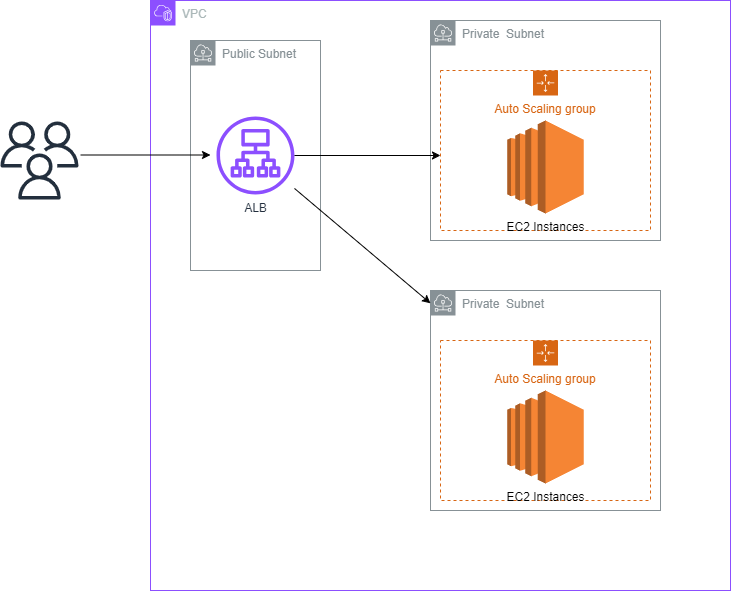
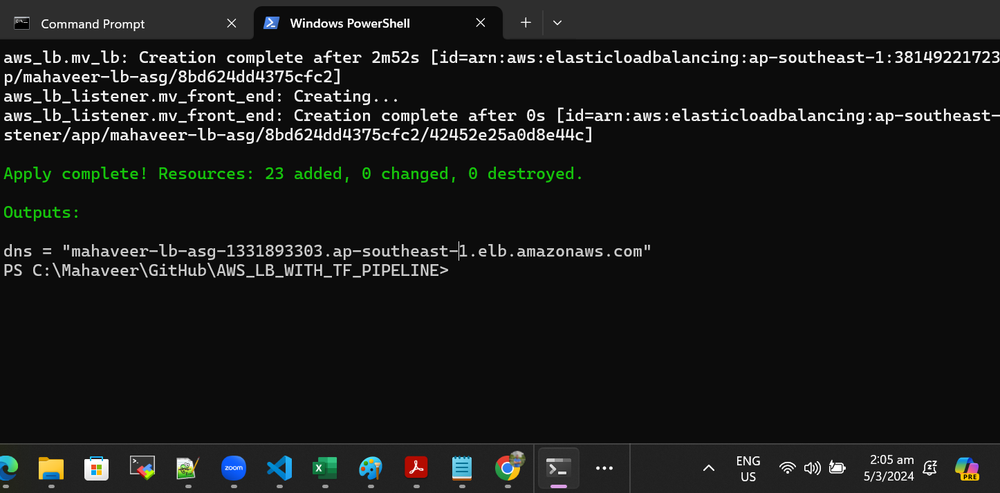
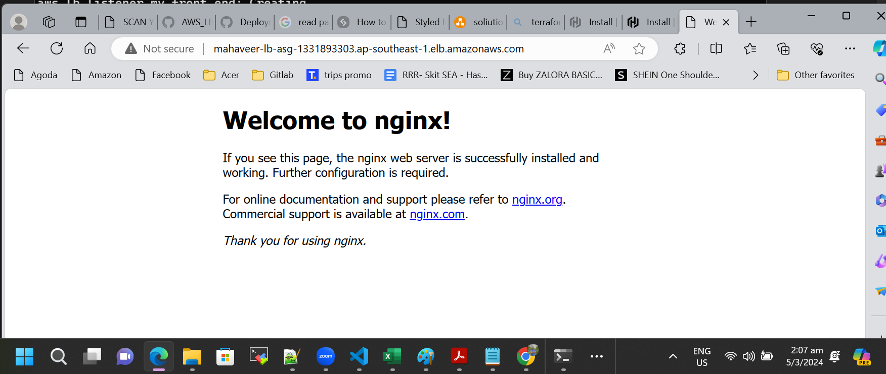
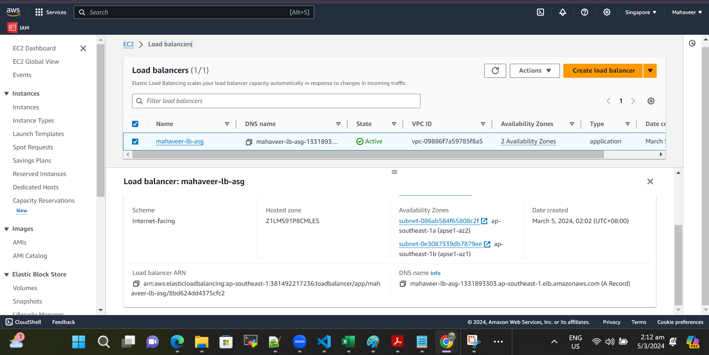
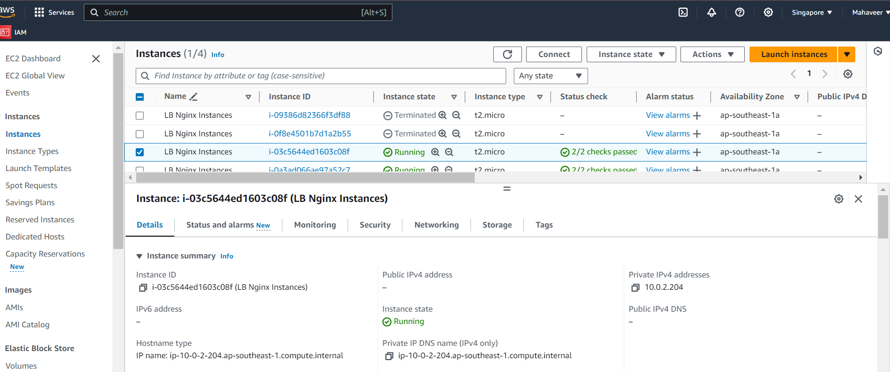

# Project 
Load Balancer in AWS

# Solution Diagram
  

# Tested on 
 - Terraform version : 1.5.7
 - aws provider version :  5.39.0
 - AWS Free Tier

# What it does
 1. Creates VPC , Private & Public Subnets, Creates ALB with Autoscaling 
 2. Runs a pipeline in GitHub Actions whenever code is pushed to main branch

# Output
1. Tested locally and it can run automatically on GitHub Actions , didn't apply as it'll incur cost

  

2. Nginx Web Server running through LB

  

3. Loadbalancer in AWS

  

4. Desired EC2 instances running in AWS

  
